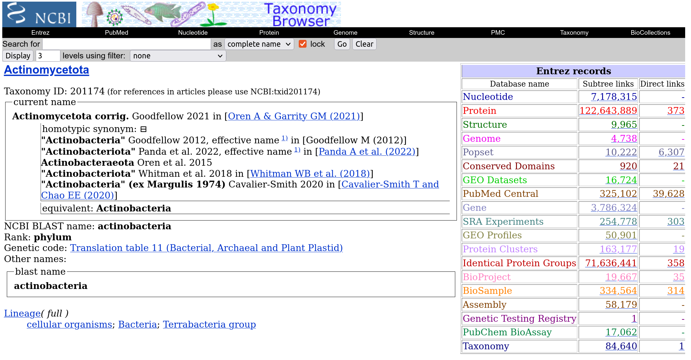

You can use the NCBI's Taxonomy Browser to get somewhat of an estimate of how big your dataset will be when downloading taxa from NCBI ([https://www.ncbi.nlm.nih.gov/taxonomy](https://www.ncbi.nlm.nih.gov/taxonomy)). The number of "Nucleotide", "Protein", "Identical Protein Groups", and "Assembly" numbers correlate to:

- Nucleotide
  - (:nucleotide) nodes
- Protein
  - [:ENCODES] relationships
- Identical Protein Groups
  - (:protein) nodes
- Assembly
  - (:assembly) nodes

An [example for Actinomycetota](https://www.ncbi.nlm.nih.gov/Taxonomy/Browser/wwwtax.cgi?mode=Info&id=201174&lvl=3&lin=f&keep=1&srchmode=1&unlock
) is shown below

