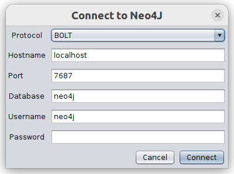
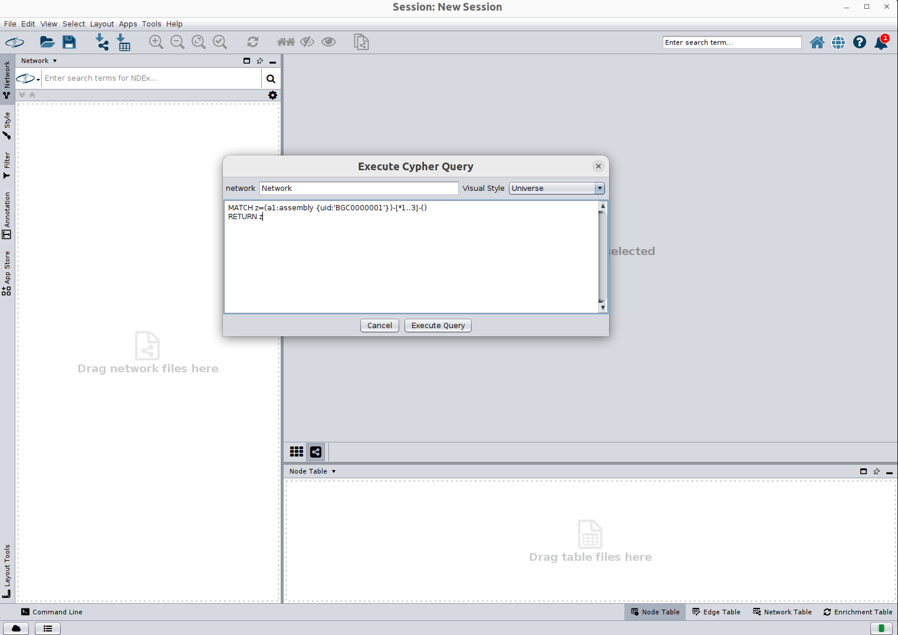
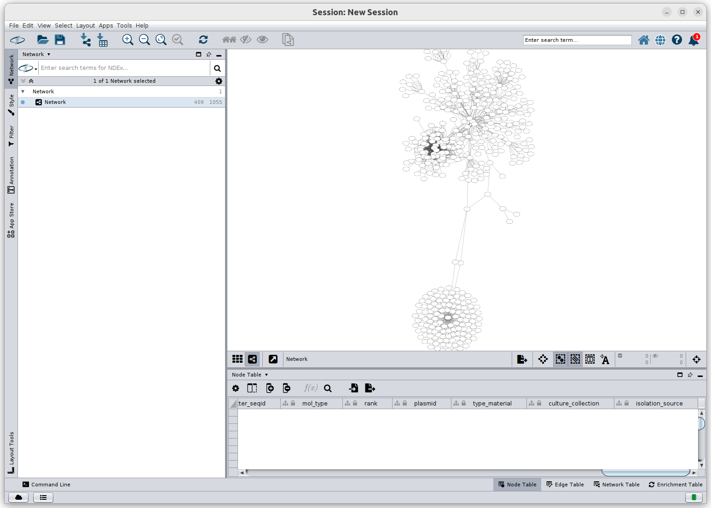

## Querying the database directly, from Neo4j's browser view

One of the easiest methods to start playing with your database is viewing it within Neo4j's web browser (but you'll need to know the [graph query language "Cypher"](https://neo4j.com/docs/getting-started/cypher-intro){: target='_blank'})

## From VSCode 

You can connect to and query the database from inside VSCode editor. This is helpful for writing/debugging code that interacts with the database. See: https://neo4j.com/developer-blog/run-cypher-without-leaving-your-ide-with-neo4j-vscode-extension/

## Cytoscape

A running Neo4j database can be queried from within Cytoscape for visualizing and creating presentable subgraphs

- Cytoscape can be downloaded here: [https://cytoscape.org/download.html](https://cytoscape.org/download.html)
- And the Neo4j Cytoscape plugin can be installed from here: [https://apps.cytoscape.org/apps/cytoscapeneo4jplugin](https://apps.cytoscape.org/apps/cytoscapeneo4jplugin)

### Import into Cytoscape
In Cytoscape go to the `Apps` menu at the top of the window and select `Cypher Queries`, within that submenu select `Import Cypher Query`. A popup should appear asking for credentials. These are what were provided as arguments to the Docker command that started up the database. If you didn't modify the Docker command then all you should have to enter is the password which is `test12345`

Then enter your beautiful Cypher query (in this example all nodes and relationships within 3-hops from BGC0000001 will be imported)

And witness your creation

