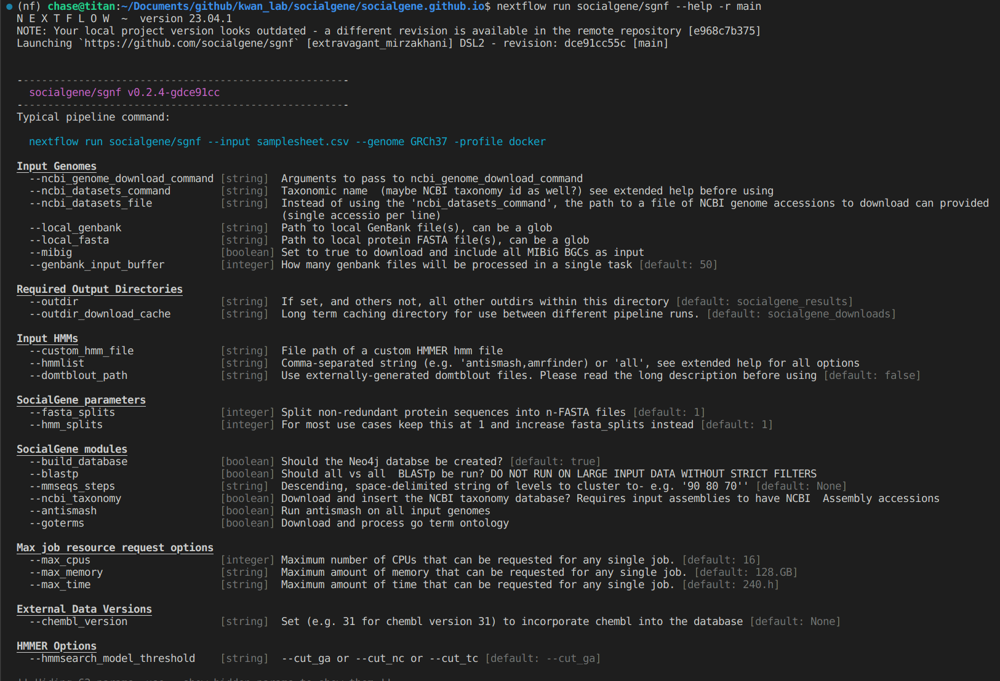
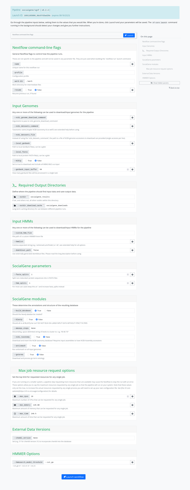

# Parameters galore!

Nextflow workflows tend to be parameter-heavy and this one is no different. The best and most up-to-date way to see the available parameters and their descriptions is to use Nextflow or nf-core directly

### Using Nextflow directly

To print a short list of parameters available in the Nextflow workflow:

=== "shell"
```bash
nextflow run socialgene/sgnf --help
```



And to see all parameters:

=== "shell"
```bash
nextflow run socialgene/sgnf --help --show_hidden_params
```

### Using nf-core

By running `nf-core launch` but cancelling instead of launching a run.

=== "shell"
```bash
nf-core launch socialgene/sgnf
```



