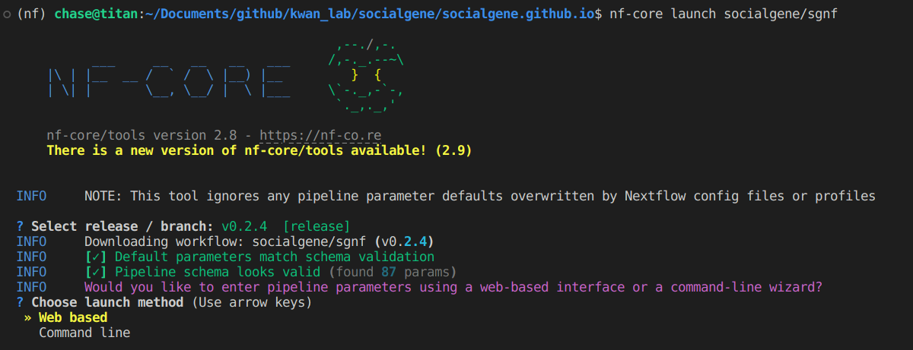
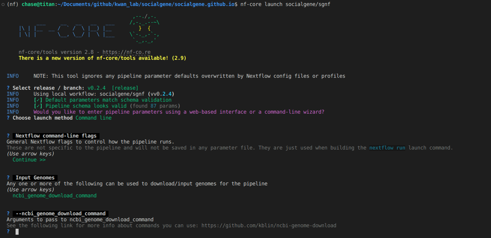
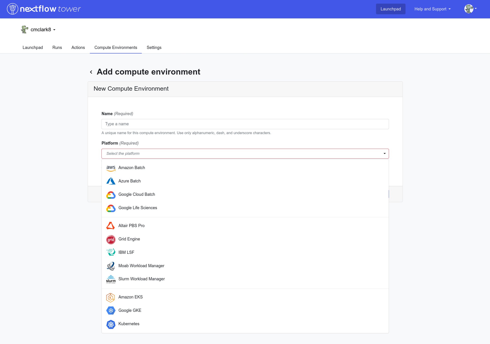
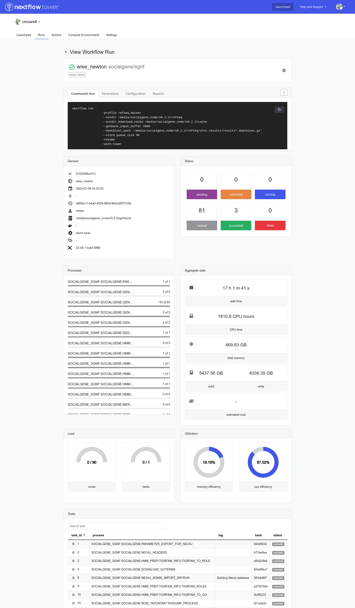

## Configuration

Nearly all of SocialGene's parameters are contained in one file `common_parameters.env`. (You may notice the file is seen in a couple of places but it's all the same file and modifications to any one `common_parameters.env` will modify all `common_parameters.env` files- the actual file is in `./socialgene/src/socialgene/common_parameters.env`) Settings specified here have effects in the Python package (and therefore Nextflow) and Django app.

## Creating the Neo4j Database

### Creating a Nextflow configuration file

The easiest way to get started is to use the example, basic Nextflow configuration file (it's located in: `~/nextflow/conf/examples/simple_run.config`)

Open that file and take a look at the values within the `params{ ... }` block

Change the memory and cpu values to fit your computer.

### Selecting the "modules" you want to use

Currently you can choose between `hmms`, `mmseqs2`, or `blastp` for making protein-protein connections in the database

MMseqs2 is quite fast and can be used for most data sizes. On the other hand, the all-vs-all Diamond Blastp option isn't super fast and will generate larger outputs (~40GB for 200 genomes), so only set it to true if you have a descent number of cpu cores and less than maybe a couple dozen input genomes.

`builddb` is set to `true` or `false` and tells determines whether the last step, building the Neo4j database, should be performed. If set to `false`, all data gathering and processing steps will still be performed, only the final database import step will be skipped.

If you're using genomes from NCBI and `ncbi_taxonomy = true` then the NCBI taxonomy database will be downloaded, formatted and included in the graph database.

### Running the Nextflow pipeline

Set where you want all the files to write to (the `outdir` below), and run the Nextflow pipeline.

=== "shell"
```bash
outdir="/home/chase/Documents/socialgene_data/micromonospora"

nextflow run nextflow \
    -profile simple_run,conda \
    --outdir_per_run $outdir/run_info \
    --outdir_neo4j "$outdir/neo4j" \
    --outdir_long_cache "$outdir/long_cache"  \
    -resume
```

- `outdir_per_run` will contain information about the run (timings, memory used, etc)
- `outdir_neo4j` will contain **both** the neo4j database **and** the files used to create it/import
  - This directory structure is required for import step when creating the neo4j database. If you won't need to "resume" the nextflow pipeline the `import` directory can be deleted
- `outdir_long_cache` contains things like the HMM models which shouldn't vary between runs of the workflow.

### Making things faster by parallelizing

Note: The PYHMMER annotation step will finish faster if the proteins are split and provided in parallel. To do this, append `--fasta_splits` to the Nextflow command above and set the number of splits to perform (e.g. `--fasta_splits 12`). At the bottom of the `simple_run.config file you'll notice:

```base
process {
 withName:PYHMMER {
        cpus   = { check_max( 2    * task.attempt, 'cpus'    ) }
        memory = { check_max( 2 * task.attempt, 'memory'  ) }
        time   = { check_max( 600.h  * task.attempt, 'time'    ) }
    }
}
```

A good rule of thumb is to set this process' cpus to `2` as shown here, and to set `--fasta_splits` to at least 1/2 the `max_cpus` argument. For large datasets setting this even higher will allow following progress of the task easier and provide more checkpoints if something fails along the way and the pipeline has to be restarted.

### Nextflow Pipeline Execution Time

The length of time the pipeline takes relies heavily on the number of cores used (and possibly RAM (when using pyHMMER)), so estimates are difficult. On my work desktop (AMD® Ryzen 9 3900xt 12-core processor × 24 | 62.7 GiB RAM) a single genome will finish in a couple minutes (When starting from scratch, usually downloading PFAM is the longest step), and annotating all Micromonospora (~200 genomes) may take a couple of hours. On our lab's server (100 logical cores | 1 TB RAM ) using 40 logical cores, a couple thousand genomes ran through in just under 24 hours (though this was done while under concurrent heavy use by others).


## nf-core GUI

Begin by launching the workflow from the computer you want the coordinating Nextflow process to run.

```
nf-core launch socialgene/sgnf
```


Selecting "Command line" will walk you through a somewhat onerous CLI-interface where you can set each of the parameters.



Alternatively, selecting "Web based" will open a web-based GUI where you can enter in parameters and then launch the workflow.


## Nextflow Tower

The pipeline can also be run/managed via Nextflow Tower which provides the ability to launch in a number of compute environments but is beyond the scope of this documentation. See [https://help.tower.nf/latest/#why-nextflow-tower](https://help.tower.nf/23.2/#why-nextflow-tower){: target='_blank'} for more information




