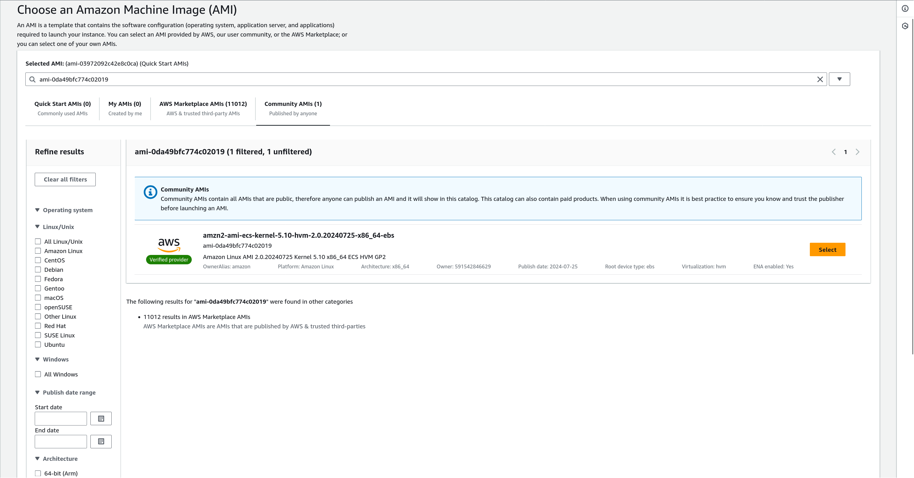
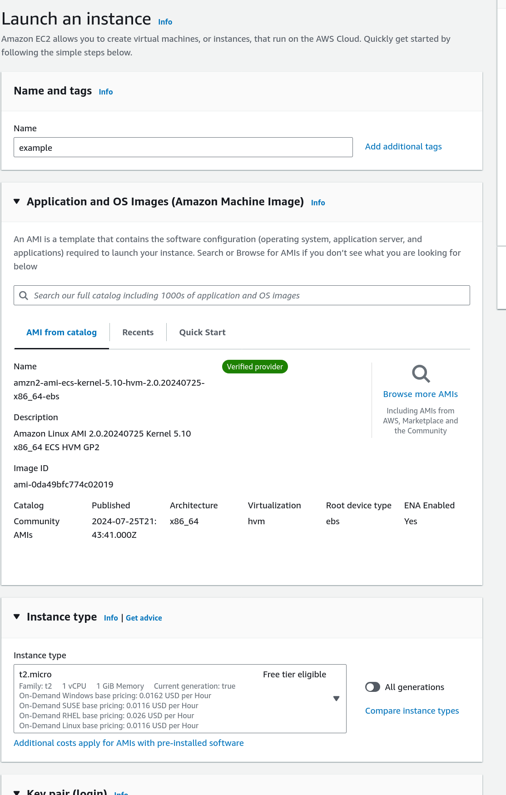
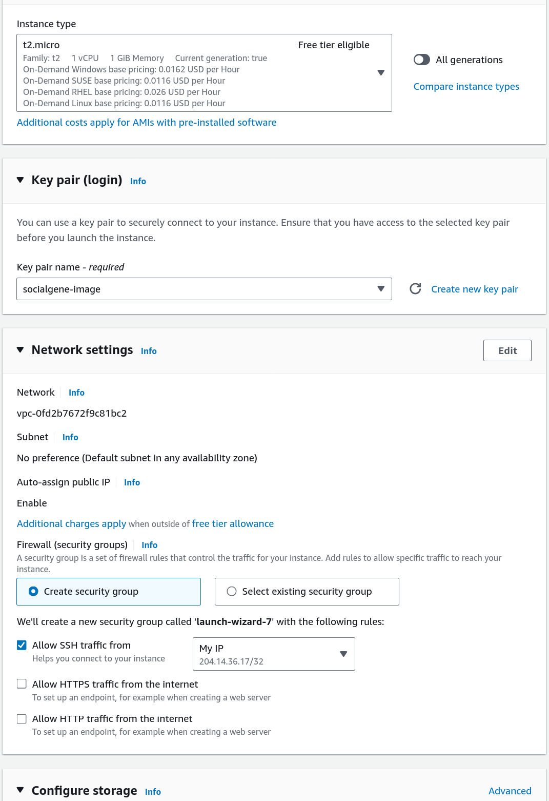
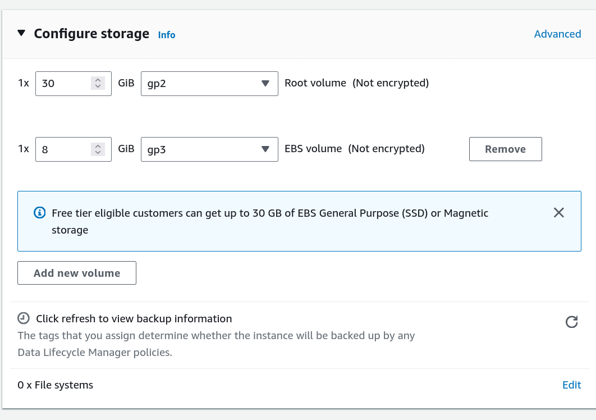

# Create a compute instance and install Neo4j

This guide will walk you through getting a *very* setup of getting Neo4j Community Edition installed on an AWS EC2 instance and rehydrating a SocialGene database on it. This guide is not intended for production use, but rather as a starting point (i.e. you are resposinble for securing the instance, setting up backups, any costs, etc.). AWS open data datasets are free to access but you will be charged for the EC2 instance, storage, etc.

The instance is created with an attached EBS volume that is formatted and mounted at /data. The Neo4j configuration file is updated to use the /data directory for the database and other directories.

## Launch a new EC2 instance

- Search for AMI `ami-0da49bfc774c02019`  (amzn2-ami-ecs-kernel-5.10-hvm-2.0.20240725-x86_64-ebs) (This is the basic Amazon AMI Linux 2 but with Amazon JDK 17 preinstalled which is required for Neo4j)

{: .centered-img }

- Select an instance type. Here a t2.micro is chosen for the example but you will likely want a larger instance type for the larger databases

{: .centered-img }

- Select a key pair login or create a new one
- In network settings select "Allow SSH traffic from and "My IP" to restrict access to your IP address

{: .centered-img }


- In "Configure Storage" select "Add new volume" of size enough to hold the database dump and the rehydrated database. For example, the RefSeq database dump is 220 GB and the rehydrated database is 663 GB, so you'd probably want a ~1TB volume. Select edit file systems (bottom right "eidt" in screenshot) and select the device name (e.g. /dev/sdb).

{: .centered-img }


- ssh into the instance (replace the .pem filepath below with the one you downloaded in the "key pair (login)" step above and the public DNS (e.g. `ec2-111-11-11-111.compute-1.amazonaws.com`) of your instance)

`ssh -i /home/chase/.aws/socialgene-image.pem ec2-user@ec2-111-11-11-111.compute-1.amazonaws.com`

`ssh -i REPLACE-ME ec2-user@REPLACE-ME`

!!!note

    The second EBS volume defaults to not deleting on termination. If you want to delete the volume when the EC2 instance is terminated, you will need to change the setting in the EC2 console. Without delete on termination you have to manually delete the volume in the EC2 console after terminating the instance. If you don't delete the volume you will continue to be charged for the storage.

# Within the EC2 instance

Terminal commands in rest of this tutorial are run within the EC2 instance unless otherwise noted.

## Format and mount the EBS volume

The second attached EBS volume is mounted at /dev/xvdb (or whichever device name you assigned to the volume during EC2 creation). But the volume is not automatically mounted or formatted. Format the volume with the XFS file system and mount it at /data.

```bash
sudo mkfs -t xfs /dev/xvdb
sudo mkdir /data
sudo mount /dev/xvdb /data
```

## Install Neo4j

Run the following commands to install Neo4j Community Edition v5 on Amazon Linux 2.


Setup the Neo4j repository
```sh
sudo rpm --import https://debian.neo4j.com/neotechnology.gpg.key
sudo tee /etc/yum.repos.d/neo4j.repo << EOF
[neo4j]
name=Neo4j RPM Repository
baseurl=https://yum.neo4j.com/stable/5
enabled=1
gpgcheck=1
EOF
```

Install Neo4j

```sh
sudo yum install neo4j -y
```

## Setup the Neo4j configuration file

For simplicity we will mostly use the default Neo4j configuration file in this tutorial. The default configuration file is located at `/etc/neo4j/neo4j.conf`. We will update the configuration file so that the database data and logs, plugins, etc will be stored and run from the `/data` directory (the second EBS volume). For production use, you will want to adjust the [configuration settings](https://neo4j.com/docs/operations-manual/current/configuration/configuration-settings/) to meet your specific needs.


```sh
DATA_DIR=/data/neo4j/data
PLUGINS_DIR=/data/neo4j/plugins
LOGS_DIR=/data/neo4j/logs
LIB_DIR=/data/neo4j/lib
IMPORT_DIR=/data/neo4j/import
TRANSACTION_LOGS_DIR=/data/neo4j/transaction-logs

# Function to update or add configuration entries
update_config() {
    local key=$1
    local value=$2
    local config_file="/etc/neo4j/neo4j.conf"

    # Use sed to update the configuration if it exists, otherwise add it
    if sudo grep -q "^${key}=" $config_file; then
        sudo sed -i "s|^${key}=.*|${key}=${value}|" $config_file
    else
        echo "${key}=${value}" | sudo tee -a $config_file > /dev/null
    fi
}

# Update or add configuration entries
update_config "server.directories.data" $DATA_DIR
update_config "server.directories.plugins" $PLUGINS_DIR
update_config "server.directories.logs" $LOGS_DIR
update_config "server.directories.lib" $LIB_DIR
update_config "server.directories.import" $IMPORT_DIR
update_config "server.directories.transaction.logs.root" $TRANSACTION_LOGS_DIR
```

For the smaller databases you can stream the dump file from S3 and rehydrate the database in one step. For the larger databases you will likely want to download the dump file to the instance before rehydrating the database.

### Stream the dump file from S3 and rehydrate the database

```sh
curl -s https://my_bucket.s3.amazonaws.com/socialgene/neo4j.dump - |\
    sudo neo4j-admin database load --from-stdin neo4j --overwrite-destination=true
```

### Download the dump file from S3 and rehydrate the database

```sh
# Download the dump file from S3
curl https://my_bucket.s3.amazonaws.com/socialgene/neo4j.dump > /data/neo4j.dump
# Rehydrate the database
sudo neo4j-admin database load --from-path=/data/neo4j.dump -neo4j --overwrite-destination=true
```

## Run Neo4j

Start the Neo4j service and check the status.

```sh
sudo start neo4j
```

# Access Neo4j

Now there is a running SocialGene database on the EC2 instance. The default username and password for the Neo4j browser are `neo4j`. On first login you will be prompted to change the password.

 From here you can:

- Download SocialGene's Python package and use the `socialgene` command line tool to interact with the database from within the EC2 instance.
- Modify the security group settings to allow access to the Neo4j browser from your IP address and access the Neo4j browser from your local machine.
    - This requires you to open TCP port 7474 and 7687 in the security group settings for the EC2 instance.
    - You can then access the Neo4j browser at `http://<public-dns>:7474` (replace `<public-dns>` with the public DNS of your EC2 instance).
- Use an SSH tunnel to access the Neo4j browser from your local machine.
    - Run the following command on your local machine to create an SSH tunnel to the EC2 instance. Replace `/path/to/your.pem` with the path to your .pem file and `<public-dns>` with the public DNS of your EC2 instance.
    - `ssh -i /path/to/your.pem -L 7474:localhost:7474 -L 7687:localhost:7687 ec2-user@ec2-111-11-11-111.compute-1.amazonaws.com`
    - You can then access the Neo4j browser at `http://localhost:7474` in your local browser.


Any example Cypher queries from the documentation can be run in the Neo4j browser. For example, to get 10 genome assemblies you can run the following query:

```cypher
MATCH (b:assembly) RETURN b LIMIT 10
```

You will probably want to add indexes to the database. This can be done by installing the SocialGene Python package and then running `sg_index` in the command line. For example, to add indexes for the assembly, nucleotide, protein, and taxid nodes you can run the following command:

```sh

NEO4J_USER=neo4j
NEO4J_PASSWORD=neo4j
NEO4J_URI=bolt://localhost:7687 # change this if you are not running on localhost

sg_index --labels assembly nucleotide protein taxid
```

