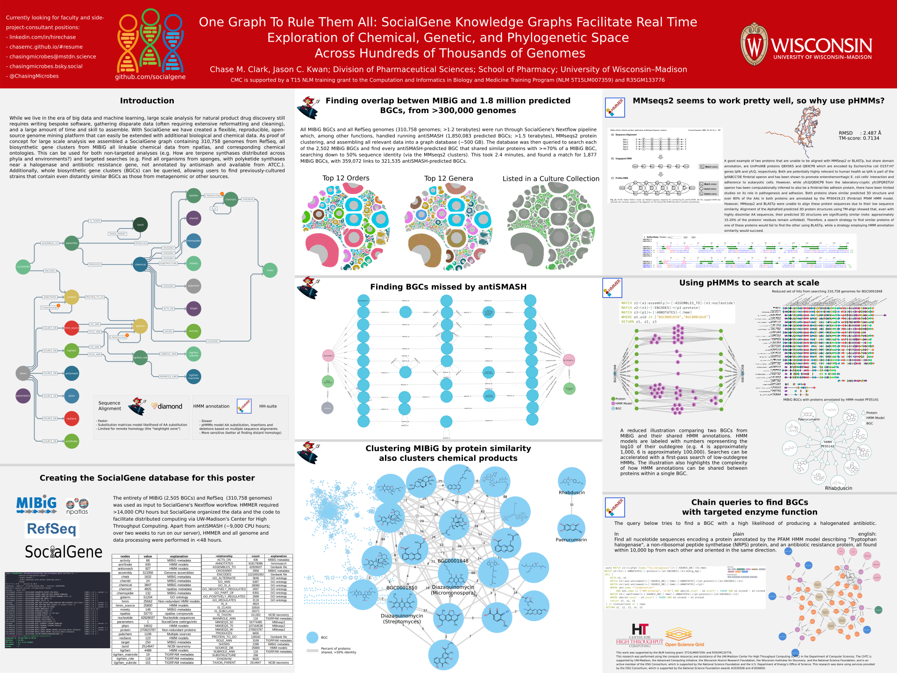
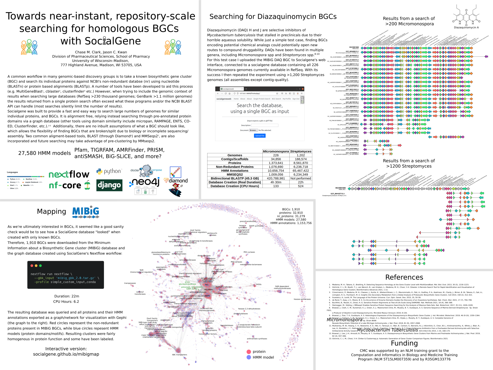

# Posters and Recorded Talks

## Jason's talk at the 2023 [ASP](https://www.pharmacognosy.us/) meeting
<iframe width="560" height="315" src="https://www.youtube.com/embed/TBDTNq_Xb4c?si=T5KzlJuHDONUFKGw&amp;start=1362" title="YouTube video player" frameborder="0" allow="accelerometer; autoplay; clipboard-write; encrypted-media; gyroscope; picture-in-picture; web-share" allowfullscreen></iframe>

## Chase's poster at the 2023 [ASP](https://www.pharmacognosy.us/) meeting

## Chase's poster at the 2023 [CIBM](https://cibm.wisc.edu/) retreat

# Rosalind's poster at the 2023 [UW Madison Psychedelic Symposium](https://ce.pharmacy.wisc.edu/pd/uw-madison-psychedelic-symposium-2/)

## Chase's poster at the 2022 [Marine Natural Products GRS/GRC](https://www.grc.org/marine-natural-products-conference/2024/)

