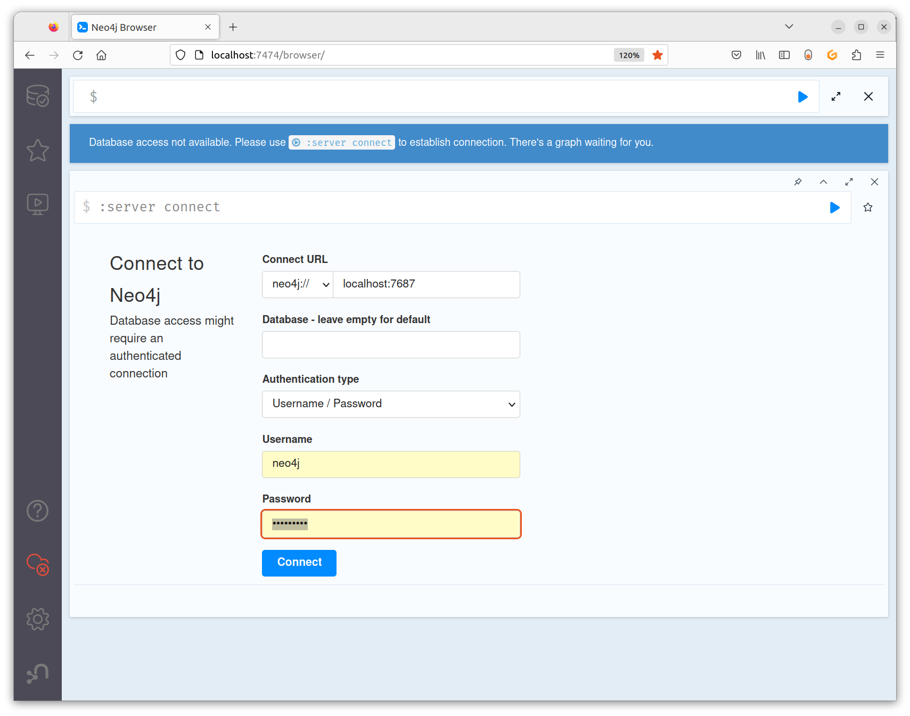
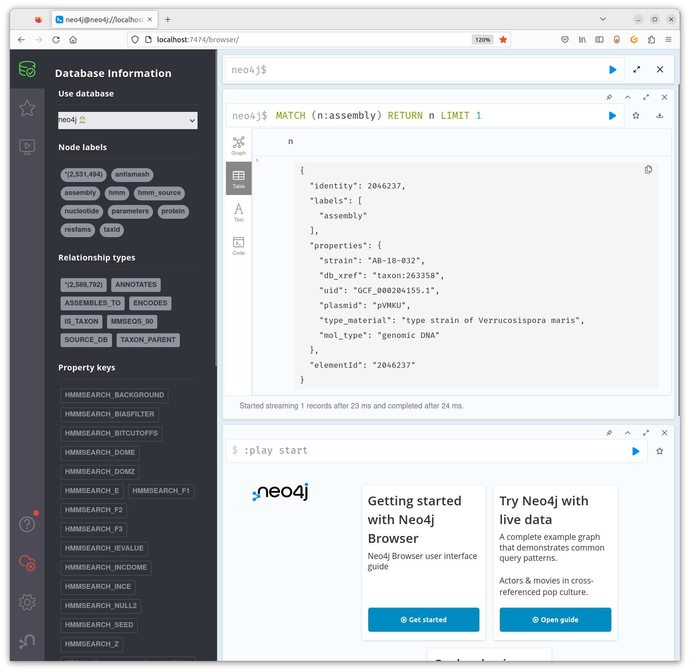

## Preface

This tutorial assumes you already have [Nextflow](/nextflow/installation) and [Docker](https://docs.docker.com/get-docker/){: target='_blank'} installed.


## Create a SocialGene Database

### Pull the latest version of SocialGene's Nextflow workflow

```
nextflow pull socialgene/sgnf
```

### Run the Nextflow pipeline

Assign `outdir` and `outdir_download_cache` paths below with the paths you want the results to be placed into. Open bash or whatever shell you use, run the commands, and (fingers-crossed) watch the magic happen.

=== "shell"
```bash
outdir='/tmp/socialgene_data/ultraquickstart'
outdir_download_cache='/tmp/socialgene_data/cache'

nextflow run socialgene/sgnf \
    -profile ultraquickstart,docker \
    --outdir $outdir \
    --outdir_download_cache $outdir_download_cache \
    --max_cpus 4 \
    --max_memory 4.GB \
    -resume
```

Note: some parameters have changed since video below was recorded
<div id="video" class="tabcontent" style="display:inline-block;width: 75%">
<script id="asciicast-O4eRe3YNVeRPR4ekRZMH0ry3s" src="https://asciinema.org/a/O4eRe3YNVeRPR4ekRZMH0ry3s.js" async></script>
</div>

#### Nextflow Pipeline Execution Time

The length of time the pipeline takes relies heavily on the number of cores used and disk speed, so estimates are difficult. On my work desktop (AMD® Ryzen 9 3900xt 12-core processor) the `ultraquickstart` config (two genomes) will run start-to-finish in a couple of minutes. For these small runs, downloading Docker images and PFAM can be the longest step if they aren't already cached. MMseqs2 and DIAMOND run times are dependent on the number of input proteins, while HMM annotation depends on both the number of input proteins and number of HMM models.

Annotating all Micromonospora genomes (~200) with multiple HMM databases (e.g. PFAM, TIGRFAM, etc.) may take a couple hours. On our server (100 logical cores | 1 TB RAM ) (while also under heavy use by others) using slurm and maximum of 40 logical cores, a couple thousand *Streptomyces* genomes ran through in just under 24 hours.

## Launch the database

Notice that the `sg_neoloc` path below is the `$outdir` path from above plus `/socialgene_neo4j` (the newly created neo4j database directory)

=== "shell"
```bash
sg_neoloc='/tmp/socialgene_data/ultraquickstart/socialgene_neo4j'

docker run \
    --user=$(id -u):$(id -g) \
    -p7474:7474 -p7687:7687 \
    -v $sg_neoloc/data:/data \
    -v $sg_neoloc/logs:/logs \
    -v $sg_neoloc/import:/var/lib/neo4j/import \
    -v $sg_neoloc/plugins:/plugins \
    -v $sg_neoloc/conf:/var/lib/neo4j/conf \
        --env NEO4J_AUTH=neo4j/test12345 \
        --env NEO4J_PLUGINS='["apoc", "graph-data-science"]' \
        --env NEO4J_dbms_security_procedures_unrestricted=algo.*,apoc.*,n10s.*,gds.*, \
        --env NEO4J_dbms_security_procedures_allowlist=algo.*,apoc.*,n10s.*,gds.* \
        --env NEO4J_server_config_strict__validation_enabled=false \
        --env NEO4J_server_memory_heap_initial__size='4G' \
        --env NEO4J_server_memory_heap_max__size='4G' \
        --env NEO4J_server_memory_pagecache_size='3G' \
        --env NEO4J_server_jvm_additional='-XX:+ExitOnOutOfMemoryError' \
    neo4j:5.16.0
```

If you get some error about ports being unavailable/used, you'll want to change the line `-p7474:7474 -p7687:7687`.
The first number before the colon is what you'll change, the new number(s) will be what you use for the address below (under "Look at what you've made!"). For detailed info about port configuration in NEO4J see: [https://neo4j.com/docs/operations-manual/current/configuration/connectors](https://neo4j.com/docs/operations-manual/current/configuration/connectors){: target='_blank'}


## Look at what you've made!

Open an internet browser and go to the url: `http://localhost:7474`.

You should see a login screen:


The username/password were set inside the `docker run` command (`--env NEO4J_AUTH=neo4j/test12345`). In this case the username was `neo4j` and password was `test12345`.

After authenticating you should be able to see the database entries and start querying the database:

